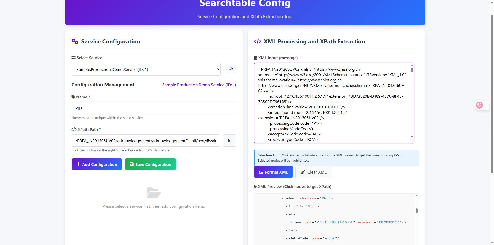
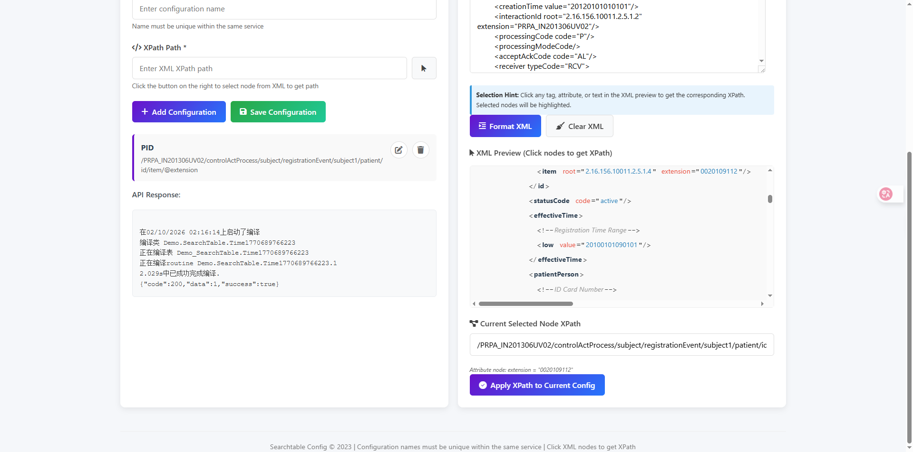

# IRIS-SearchTable-Config

Searchtable Config is a web tool for service configuration and XPath extraction, enabling users to manage XML XPath configurations for different services, with XML formatting, node selection, and XPath extraction capabilities.
---
## Features
### 1. Service Configuration Management
- **Dynamic Service Loading**: Service lists are retrieved from currently running production services
- **Configuration Item Management**: Add, edit, and delete configuration items for each service
- **Uniqueness Validation**: Configuration item names must be unique within the same service
- **Data Persistence**: Configuration data is stored in the database and persists after page refresh
### 2. XML Processing Features
- **XML Formatting**: Input XML content and format it into a readable tree structure
- **XPath Extraction**: Click XML nodes to obtain corresponding XPath paths
- **XPath Application**: Apply selected XPath to the current configuration item

## How to use it
### 1. Service Configuration
- Service lists are automatically loaded from the API when the page loads
- Select the service to configure from the dropdown list
- Enter the configuration item name and XPath path
- Click "Add Configuration Item" to save the configuration
- Edit or delete existing configuration items
### 2. XML Processing
- Input or paste XML content in the XML input box
- Click the "Format XML" button to format the XML
- Click formatted XML nodes to obtain XPath
- Click "Apply XPath to Current Configuration" to populate the XPath into the configuration form
### 3. Data Management
- Supports cross-session data persistence
- Page can be refreshed at any time without data loss


### Page Effects








---
### Below is the page address for SearchTable Config
` http://localhost:52773/csp/user/Sample.Model.Web.Config.cls


### Prerequisites
Make sure you have git and Docker desktop installed.
### Installation
#### 1.Clone/git pull the repo into any local directory
```
git clone https://github.com/David36791/iris-searchtable-config.git
```  
#### Open the terminal in this directory and run

```
docker-compose build
```
#### Run the IRIS container 

```
docker-compose up -d
```